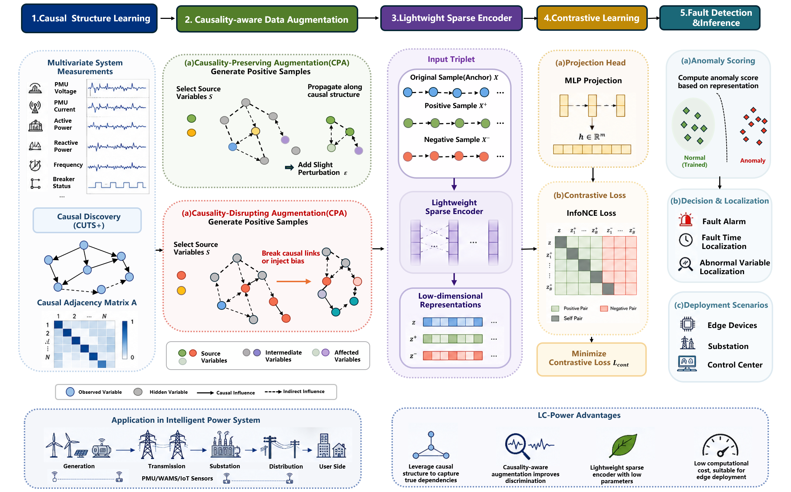

# LC-Power: Lightweight Causality-aware Contrastive Learning for Power System Anomaly Detection


## Overview
The figures below illustrate the overview pipeline and components of the LC-Power framework. For more detailed information, please refer to our paper.
LC-Power is a lightweight causal-aware framework for fault detection in intelligent power systems. The framework integrates:

(1)CUTS+-based causal discovery
(2)Causality-aware augmentation
(3)Lightweight sparse encoder
(4)Contrastive representation learning

LC-Power captures latent causal dependencies among monitoring variables while reducing computational complexity and inference latency for online deployment.

<p align="center">
  
  <br>
  <em>Overview of the proposed LC-Power framework</em>
</p>


---

## Dataset Preparation

Our data on the "https://drive.google.com/drive/folders/1DMAUp6VTeNnh2nKXe4SqXQDRjwQFOVY4?usp=drive_link"

### Download Links
| Dataset | Download Link |
|:---|:---|
| SWaT | (https://www.sutd.edu.sg/itrust/) |
| WADI | https://www.sutd.edu.sg/itrust/ |
| PSM | (https://github.com/eBay/RANSynCoders/tree/main) |
| SMD (ServerMachineDataset) | (https://github.com/NetManAIOps/OmniAnomaly/tree/master)|
| SMAP / MSL | (https://github.com/khundman/telemanom) |


> For SMD and SMAP datasets, preprocessing is based on OmniAnomaly's `data_preprocess.py`. After preprocessing, place the datasets in the following directories:
> ```
> data/
> ├── ServerMachineDataset/  # Preprocessed SMD dataset
> └── SMAP_MSL/              # Preprocessed SMAP dataset
> ```

## Installation
git clone https://github.com/1500279606/LC-Power.git

cd LC-Power

pip install -r requirements.txt

## Training
python main.py --dataset SWaT

## Environment
Python 3.9
PyTorch 2.0.1

## License
This project is licensed under the MIT License. For commercial use, permission is required.

## Acknowledgements
Please provide proper attribution if you use our codebase.
If you use our work, kindly cite our paper as mentioned in the Citation section.

